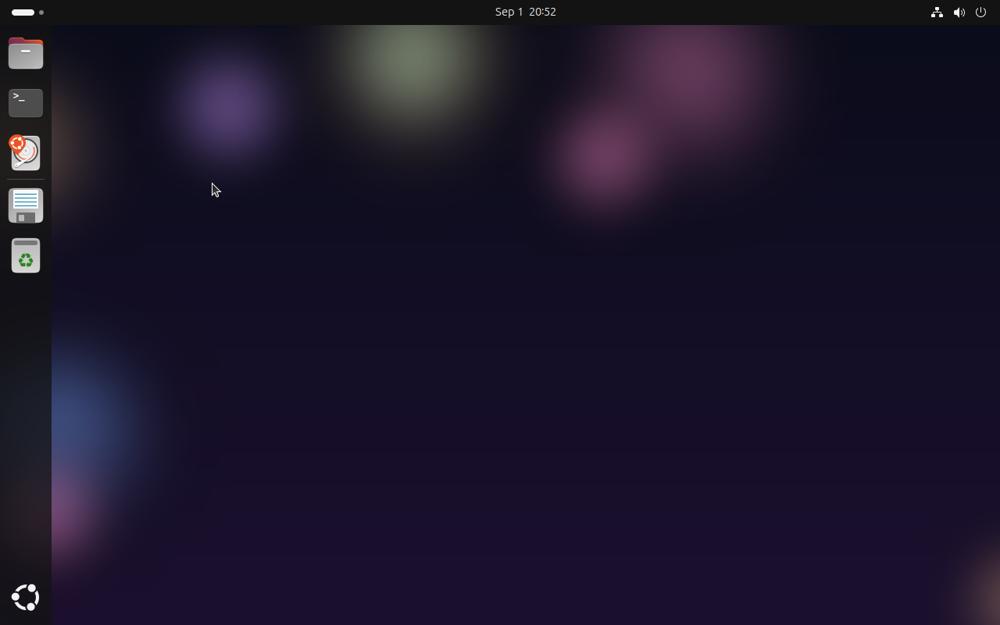
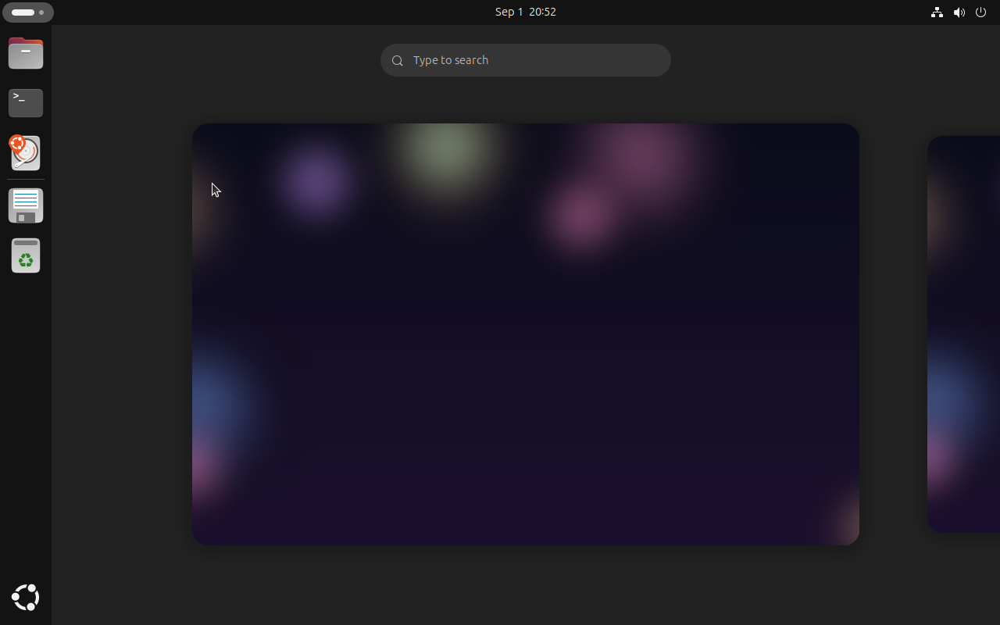
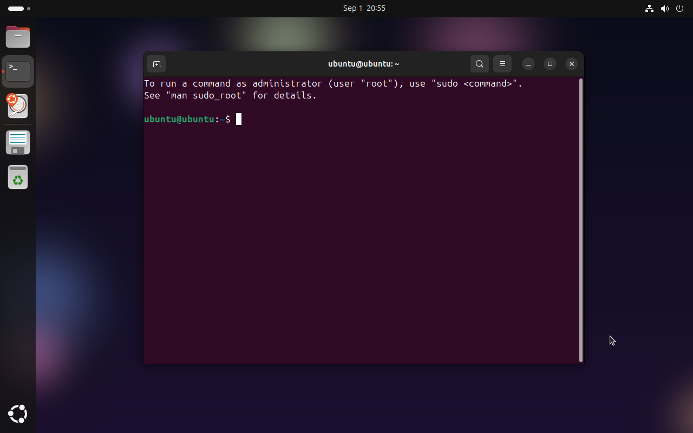

# Liquid OS

Liquid OS is a full desktop Linux distro built on Ubuntu 24.04 LTS, wrapped in
a glassmorphism "liquid glass" GNOME desktop: translucent windows and panels,
real-time background blur behind the top bar and overview, and a soft,
colorful, procedurally generated wallpaper that carries through into the boot
screen and GRUB menu. It's a real, installable OS — full `ubuntu-desktop`
plus Ubuntu's actual graphical installer — not a stripped-down demo.

## Screenshots

Captured from the built ISO actually running in QEMU (framebuffer grabs, so
this is the real booted system, not mockups):



The desktop with the procedurally generated liquid-glass wallpaper.



The GNOME Activities overview.



A terminal window over the wallpaper.

## The look

Liquid OS starts from stock Ubuntu and reworks the desktop into a frosted,
translucent look:

- **Yaru-Liquid**, a translucent variant of Ubuntu's own Yaru theme — windows,
  headerbars, popovers, and buttons get soft rgba backgrounds, rounded
  corners, and subtle highlight borders instead of flat opaque panels.
- **Real live blur**, via the [Blur My Shell](https://github.com/aunetx/blur-my-shell)
  GNOME Shell extension, enabled by default — the top bar, overview, and dash
  blur whatever's behind them in real time, not just a tinted overlay.
- **A liquid-glass wallpaper**, painted procedurally (soft blurred color
  blobs over a deep gradient) rather than a static image, so it's regenerated
  fresh on every build. The same artwork carries over into the GRUB
  background and the Plymouth boot splash, so the look is consistent from
  power-on to desktop.

## What's inside

- Ubuntu 24.04 LTS (noble) as the base — full `ubuntu-desktop`, not a minimal
  spin, so LibreOffice, Firefox, and the usual GNOME app set are there from
  first boot.
- Ubuntu's real installer (`ubiquity`) with an "Install Liquid OS" desktop
  icon — partitioning, locale, user account, the works. This is a live image
  you can install to a disk, not just a demo you boot and discard.
- The Liquid Glass theme, wallpaper, and extension set up as the defaults out
  of the box — no manual setup after install.

## Get it

Liquid OS is built by a GitHub Actions workflow in this repo (see
[`.github/workflows/build-iso.yml`](.github/workflows/build-iso.yml)) — no
local build environment needed on your end.

- **Download the latest release:**
  [v1.0.0](https://github.com/codemastervy/liquid-os/releases/tag/v1.0.0).
  The ISO is ~2.4 GB and GitHub caps release assets at 2 GB, so it is
  published as split parts. Reassemble and verify with:

  ```sh
  cat Liquid-OS-*.iso.part-* > Liquid-OS.iso
  sha256sum -c Liquid-OS-*.iso.sha256
  ```
- **Build it yourself:** go to **Actions → Build Liquid OS ISO → Run
  workflow**, wait for it to finish (a full desktop build typically takes
  15–30 minutes), then grab the `liquid-os-iso` artifact from that run.

## Try it

- **Live session:** boot the ISO as-is — in a VM (UTM, VirtualBox, VMware) or
  from a USB stick (Balena Etcher, Rufus, `dd`) — to try the desktop without
  touching your disk. In UTM on Apple Silicon: create a new VM using
  "Emulate" (not "Virtualize" — that only supports arm64 guests, and this
  ISO is x86_64), pick Linux, attach the ISO as the boot drive, and give it
  a few GB of RAM.
- **Install it for real:** the live desktop has an "Install Liquid OS" icon
  that launches `ubiquity`, Ubuntu's normal graphical installer.

## Repo layout

```
.github/workflows/build-iso.yml   CI pipeline: installs live-build, generates
                                   the wallpaper, merges the overlay below
                                   into a live-build config, runs `lb build`.
scripts/generate-wallpaper.py     Procedural liquid-glass wallpaper generator.
livebuild-overlay/
  package-lists/                  Packages installed via apt during the
                                   build: full ubuntu-desktop, the ubiquity
                                   installer stack, GNOME extensions/tweaks.
  includes.chroot/                Files copied verbatim onto the live
                                   filesystem (branding, dconf defaults, grub
                                   background config, install-desktop
                                   shortcut, wallpaper output).
  hooks/                          Scripts run inside the chroot after package
                                   installation: theme build, extension
                                   install, Plymouth/initramfs update, dconf
                                   compile.
```

## Notes / known limitations

- The ISO currently boots BIOS/legacy (isolinux) only — no UEFI boot yet.
  Most VMs and older/legacy-mode hardware are fine; a strict UEFI-only
  machine won't boot it directly yet.
- GitHub Release assets are capped at 2 GB per file; a full `ubuntu-desktop`
  ISO can exceed that. The workflow always uploads a plain Actions artifact
  regardless, as a fallback, and will report (not fail) if the release
  upload is skipped for being oversized.
